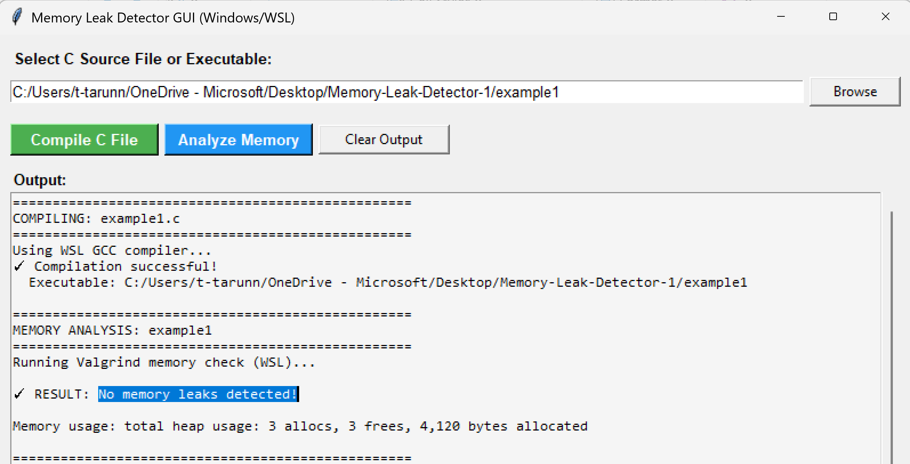
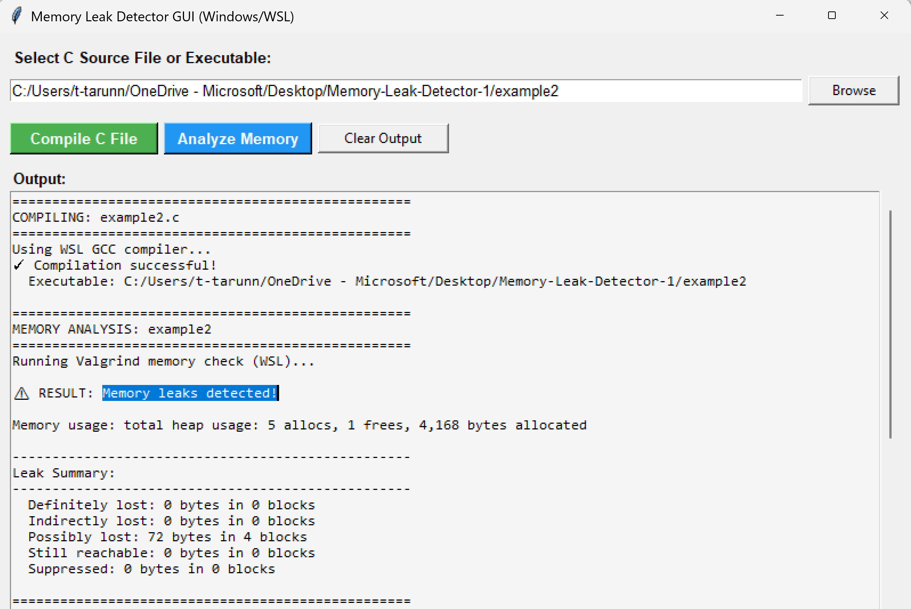
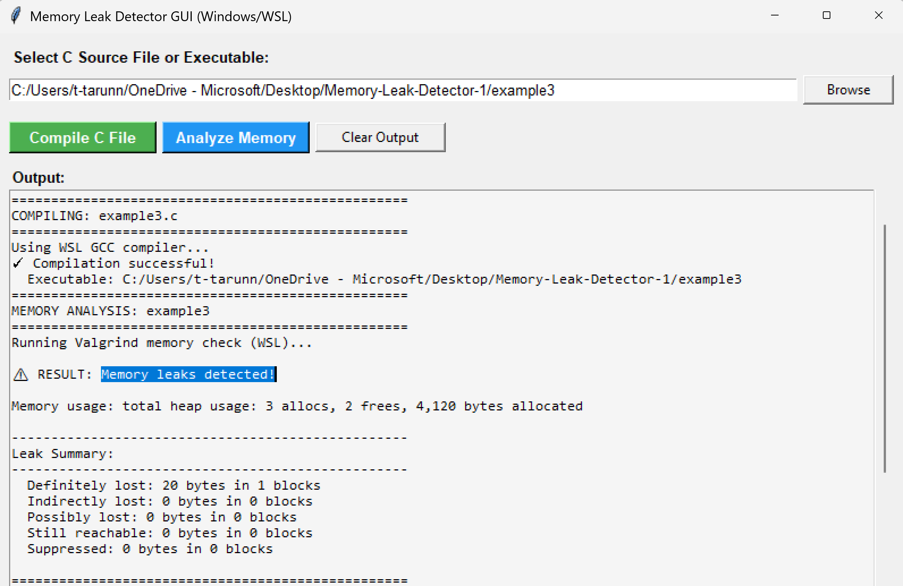

# Memory Leak Detector

A graphical application to detect memory leaks in C programs using Valgrind. Designed for Windows with WSL (Windows Subsystem for Linux), with a simpler version available for Linux users.

---

## Features

- Easy-to-use graphical interface
- Automatic C program compilation
- Memory leak detection with Valgrind
- Clear output showing memory issues
- WSL integration for Windows users

---

## Prerequisites

- **Python 3.6+** (with tkinter)
- **WSL** (Windows Subsystem for Linux)
- **GCC** (C compiler)
- **Valgrind** (memory analysis tool)

---

## Installation

### 1. Install WSL

Open PowerShell as Administrator:

```powershell
wsl --install
```

Restart your computer when prompted.

### 2. Install GCC and Valgrind

Open Ubuntu from Start Menu and run:

```bash
sudo apt update && sudo apt install -y gcc valgrind
```

---

## Usage

### 1. Run the Application

```powershell
python valgrindGUI_windows.py
```

### Using the GUI

1. **Tool Detection** - On startup, the application checks for available tools
2. **Browse** - Click "Browse" to select your C source file (`.c`)
3. **Compile C File** - Compiles your program with debugging symbols
4. **Analyze Memory** - Runs Valgrind to detect memory leaks
5. **Review Results** - Check the formatted output for leak information
6. **Clear Output** - Clears the display and re-checks tool availability

---

## Understanding Output

### No Memory Leaks

```
✓ RESULT: No memory leaks detected!
Memory usage: total heap usage: 3 allocs, 3 frees, 4,120 bytes allocated
```
All memory was properly freed.



### Memory Leaks Detected

```
⚠ RESULT: Memory leaks detected!

Leak Summary:
  Definitely lost: 48 bytes in 1 blocks
  Possibly lost: 24 bytes in 3 blocks
```



**Leak Types:**
- **Definitely lost** - Memory never freed (must fix)
- **Indirectly lost** - Memory lost due to parent pointer loss (must fix)
- **Possibly lost** - Potential leak (should investigate)
- **Still reachable** - Memory accessible at exit (usually OK)

---

## Example Programs

### example1.c - Clean Code ✓
Properly allocates memory using `malloc()` and `calloc()`, and **frees all allocated memory**. Demonstrates correct memory management practices.

**Expected Result:** No memory leaks detected

### example2.c - Complex Leaks ⚠️
Multiple nested structure allocations (`struct numbers` with dynamic arrays) without **any `free()` calls**. Demonstrates both direct and indirect memory leaks.

**Expected Result:** Multiple memory leaks (definitely lost, indirectly lost)

### example3.c - Simple Leak ⚠️
Allocates two memory blocks but **only frees one** (`ptr1`). The `ptr2` allocation is never freed, causing a simple memory leak.

**Expected Result:** Memory leak detected (one missing `free()` call)

---

## File Structure

```
Memory-Leak-Detector/
├── valgrindGUI_windows.py  # Main GUI (Windows/WSL compatible)
├── valgrindGUI.py          # Lightweight GUI (Linux native)
├── example1.c              # Example: Clean code
├── example2.c              # Example: Complex memory leaks
├── example3.c              # Example: Simple memory leak
├── setup_wsl.sh            # Automated WSL setup script
├── setup_wsl.md            # Detailed setup instructions
└── README.md               # This file
```

---

## How It Works

1. **Tool Detection**: On startup, checks for WSL, GCC, and Valgrind availability
2. **File Selection**: User selects a C source file via file browser
3. **Compilation**: Compiles the C file with debugging symbols using GCC
   - Windows: Uses WSL GCC (`wsl gcc -g -o output source.c`)
   - Linux: Uses native GCC (`gcc -g -o output source.c`)
4. **Memory Analysis**: Runs Valgrind with leak detection enabled
   - Command: `valgrind --leak-check=full --track-origins=yes executable`
5. **Output Parsing**: Parses Valgrind output and displays formatted results
6. **Result Display**: Shows memory usage, leak types, and recommendations

---

## Contributing

Contributions are welcome! Feel free to:
- Report bugs or issues
- Suggest new features
- Submit pull requests
- Improve documentation

---

This is open source project and available for educational purposes.

---